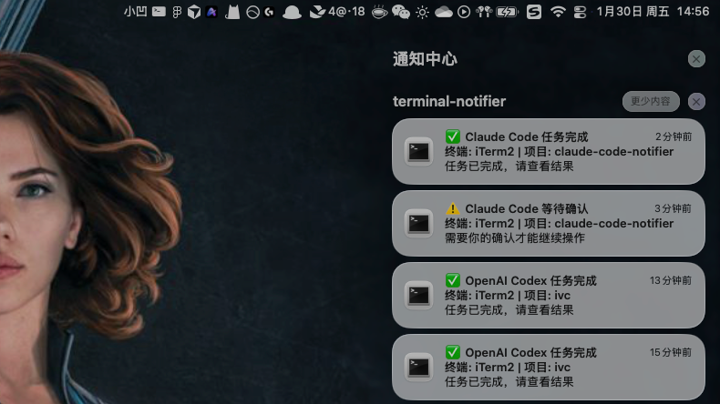

# Multi-Platform Code Notifier 🔔

[](https://github.com/luorenyu/claude-code-notifier/releases)
[](https://github.com/luorenyu/claude-code-notifier)

**不错过任何一次确认，不浪费每一秒等待。**

为 **Claude Code** (Anthropic CLI) 和 **OpenAI Codex** CLI 添加原生系统通知、声音提示和自动终端激活功能。



## 🎯 平台支持

| 平台 | 状态 | 集成方式 | 可靠性 | 延迟 |
|------|------|----------|--------|------|
| **Claude Code** | ✅ 完全支持 | 官方 Hooks 系统 | 100% | 近零延迟 |
| **OpenAI Codex** | ⚠️ 实验性支持 | 进程封装 (Wrapper) | 90% | 实时 (ms) |

### 架构对比

**Claude Code (推荐)**:
```
Claude Code 事件 → settings.json hooks → notify.sh → 系统通知
```
- 事件驱动，零延迟
- 官方支持的扩展机制
- 100% 可靠的事件传递

**OpenAI Codex (实验性)**:
```
用户输入 → Python Wrapper (PTY) → 真实 Codex 进程
                    ↓
              实时分析屏幕输出 (RegEx)
                    ↓
                notify.sh → 系统通知
```
- **轻量级**: 不监控巨型日志文件，只分析屏幕显示的文本
- **实时**: 毫秒级响应
- **无后台**: 不需要常驻系统的监控进程
- **局限**: 需要通过 Wrapper 启动 Codex (推荐设置 Alias)

## ✨ 功能特性

*   **🔔 智能通知**：区分“任务完成”(Stop) 和 “请求权限”(PermissionRequest)。
*   **🔊 声音提示**：
    *   需要确认时播放醒目的提示音。
    *   任务完成时播放清脆的完成音。
*   **🚀 自动跳转 (macOS)**：当 Claude 需要你确认权限时，自动将终端窗口带到前台（Focus），不再因为切屏看网页而忘记确认。
*   **🐧 Linux 支持**：完美支持 Linux 桌面环境 (GNOME, KDE 等)，使用 `notify-send` 和原生音频系统。
*   **⌨️ 快捷命令**：直接在 Claude 中使用 `/notifier` 命令控制通知开关。
*   **⚙️ 灵活配置**：支持配置文件 `notifier.conf`，轻松修改声音、行为和图标，升级不丢失配置。
*   **🖥️ 多终端支持**：支持 iTerm2, VS Code, Cursor, Warp, Terminal.app 以及 JetBrains 全家桶。

## 📦 安装

### 一键安装

下载本项目并运行安装脚本：

```bash
git clone https://github.com/luorenyu/claude-code-notifier.git
cd claude-code-notifier
chmod +x install.sh
./install.sh
```

### 平台选择

安装时会提示选择要支持的平台：

```
选择要安装通知功能的平台:
1) 仅 Claude Code
2) 仅 OpenAI Codex
3) 两个平台都安装
4) 取消安装
```

**推荐选项**:
- **选项 1**: 如果你只使用 Claude Code（推荐，100% 可靠）
- **选项 3**: 如果你同时使用 Claude Code 和 Codex

### 安装过程

脚本会自动：

**对于 Claude Code**:
1. 安装核心脚本到 `~/.claude/scripts/`
2. 修改 `settings.json` 添加 Hooks
3. 创建 `/notifier` Slash Command
4. **macOS**: 尝试安装 `terminal-notifier`
5. **Linux**: 检查 `libnotify` 依赖

**对于 OpenAI Codex**:
1. 安装 Python Wrapper 到 `~/.codex/scripts/`
2. 检测真实 Codex 二进制文件路径
3. 创建启动脚本 `codex-notify`
4. 提示配置 Shell Alias (必需)

### 依赖说明

**通用依赖**:
- **macOS**: 推荐 `terminal-notifier` (可选，提升通知体验)
- **Linux**: `libnotify-bin`/`libnotify` + `paplay`/`aplay`

**Codex 特定**:
- OpenAI Codex CLI 必须已安装
- Python 3 (用于运行 Wrapper)
- 需要配置 Shell Alias 使 Wrapper 生效

## 🎮 使用方法

### Claude Code

安装完成后无需额外操作。当你使用 Claude Code 时：
*   **权限请求**：弹出警告通知 + 播放提示音 + (macOS) 自动激活终端
*   **任务完成**：弹出完成通知 + 播放完成音

#### Slash Commands
在 Claude Code 对话中直接控制：
*   `/notifier status` - 查看当前通知状态
*   `/notifier off` - 临时关闭通知（会议/演示时）
*   `/notifier on` - 重新开启通知

### OpenAI Codex

安装后，你需要通过 **Alias** 启动 Codex 才能启用通知功能。

#### 配置 Alias (必需步骤)

安装脚本会提示自动添加 alias，如果选择手动添加，请将以下行添加到你的 Shell 配置文件：

**Zsh 用户** (`~/.zshrc`):
```bash
alias codex='~/.codex/scripts/codex-notify'
```

**Bash 用户** (`~/.bashrc`):
```bash
alias codex='~/.codex/scripts/codex-notify'
```

然后重新加载配置：
```bash
source ~/.zshrc  # 或 source ~/.bashrc
```

#### 使用通知版 Codex

配置完成后，像往常一样使用 `codex` 命令：
```bash
codex "帮我重构这个函数"
```

Wrapper 会：
1. 透明转发所有命令到真实的 Codex
2. 实时分析屏幕输出，检测关键事件
3. 触发系统通知（权限请求、任务完成）

#### 测试通知

手动输入一些文本来测试模式匹配：
```bash
echo "waiting for user confirmation"
# 应该触发权限请求通知

echo "• task complete"
# 应该触发任务完成通知
```

## ⚙️ 配置与自定义

### 修改配置
安装后，配置文件位于 `~/.claude/notifier.conf`。你可以修改它来：
*   更换提示音效文件路径。
*   开启/关闭自动激活终端功能。
*   自定义通知标题文字。

### 自定义图标
只需将你的图片命名为 `logo.png` 并放入 `~/.claude/assets/` 目录即可生效。
*(安装包内 `assets/` 目录下的 `logo.png` 会在安装时自动复制过去)*

> **注意 (macOS)**：macOS 高版本系统（如 macOS 12+）由于系统限制，通知可能无法显示自定义 Logo，而是显示终端应用的图标。这是 macOS 系统层面的行为，无法绕过。

## 🗑️ 卸载

运行卸载脚本会自动检测已安装的平台并清理：

```bash
./uninstall.sh
```

卸载脚本会：
- **Claude Code**: 移除 `settings.json` 中的 hooks，删除脚本文件
- **Codex**: 删除 `~/.codex/` 目录，移除 Shell 配置文件中的 alias
- 询问是否保留配置文件和资源

卸载后记得重新加载 Shell 配置：
```bash
source ~/.zshrc  # 或 ~/.bashrc
```

## 🔧 故障排除

### Codex 通知不工作

1. **检查 Alias 是否生效**:
   ```bash
   which codex
   # 应该显示: /Users/你的用户名/.codex/scripts/codex-notify

   # 如果显示其他路径，说明 alias 未生效
   ```

2. **确认 Shell 配置已重新加载**:
   ```bash
   source ~/.zshrc  # 或 ~/.bashrc
   ```

3. **检查真实 Codex 路径是否正确**:
   ```bash
   cat ~/.codex/scripts/codex-notify
   # 查看 REAL_CODEX_PATH 是否指向正确的 codex 二进制文件
   ```

4. **测试 Wrapper 是否运行**:
   ```bash
   # 直接运行 Wrapper
   ~/.codex/scripts/codex-notify --version
   # 应该显示真实 Codex 的版本信息
   ```

5. **检查通知脚本是否存在**:
   ```bash
   ls -la ~/.codex/scripts/notify.sh
   # 应该存在且可执行
   ```

6. **手动触发通知测试**:
   ```bash
   CLAUDE_TOOL_NAME="PermissionRequest" ~/.codex/scripts/notify.sh
   # 应该立即弹出通知
   ```

### Claude Code 通知正常，Codex 不正常

这是预期行为。Codex 集成依赖：
- 正确的 Alias 配置（通过 Wrapper 启动）
- Python 3 环境
- 屏幕输出匹配预定义的正则模式

如果 Codex 的输出格式变化，通知可能不会触发。

### 自定义 Codex 触发模式

编辑 Wrapper 脚本自定义匹配模式：

```bash
nano ~/.codex/scripts/codex_wrapper.py

# 修改 PATTERNS 字典 (第 20-26 行):
PATTERNS = {
    r"你的自定义正则": "PermissionRequest",
    r"另一个模式": "Stop",
}
```

**当前支持的模式**:
- **PermissionRequest**: `waiting for user|permission required|confirmation needed|Would you like to`
- **Stop**: `task complete|execution finished|done\.|completed successfully` 或单独的 `•` 字符（排除工具动作行）

## 🤝 贡献

欢迎提交 Issue 和 PR：
- 适配更多终端类型或 Linux 发行版
- 改进 Codex 输出模式匹配
- 报告 Codex 输出格式变化
- 添加其他 CLI 工具支持

如果你发现 Codex CLI 的输出格式与 Wrapper 不匹配，请提交 Issue 并附上输出示例！

## 📚 技术细节

### Claude Code 集成原理

使用 Claude Code 的官方 hooks 系统：

```json
{
  "hooks": {
    "PermissionRequest": [{
      "matcher": "*",
      "hooks": [{
        "command": "CLAUDE_TOOL_NAME=\"PermissionRequest\" ~/.claude/scripts/notify.sh",
        "type": "command"
      }]
    }]
  }
}
```

事件类型：
- `PermissionRequest`: 需要用户确认时触发
- `Stop`: 任务完成时触发

### Codex 集成原理

由于 Codex 缺乏官方 hooks 系统，使用 **PTY (伪终端) 封装方案**：

1. **Python Wrapper (`codex_wrapper.py`)**:
   - 使用 `pty.fork()` 创建伪终端
   - 在伪终端中启动真实的 Codex 进程
   - 透明转发所有用户输入和程序输出

2. **实时输出分析**:
   - 监听 Codex 的屏幕输出流
   - 使用正则表达式实时匹配关键事件
   - 不依赖日志文件，直接分析显示内容

3. **事件触发**:
   - 检测到匹配模式时调用 `notify.sh`
   - 使用防抖机制避免重复通知（3秒内相同事件只触发一次）

4. **终端兼容性**:
   - 完整支持终端调整大小 (SIGWINCH)
   - 支持所有控制字符和 ANSI 转义序列
   - 完全透明，用户体验与原生 Codex 一致

**匹配模式** (codex_wrapper.py:20-26):
- 权限请求: `waiting for user|permission required|confirmation needed|Would you like to`
- 任务完成: `task complete|execution finished|done\.` 或单独的 `•` 字符
- 智能排除: 自动过滤工具动作行（`Running`, `Reading`, `Editing` 等）

**架构优势**:
- ✅ 零后台进程 - 只在使用 Codex 时运行
- ✅ 实时响应 - 毫秒级延迟
- ✅ 轻量级 - 不监控巨型日志文件
- ✅ 可维护 - 易于调整匹配模式

**限制**:
- ⚠️ 需要通过 Alias 启动（无法自动拦截）
- ⚠️ 依赖输出格式（Codex 更新可能需要调整模式）
- ⚠️ Python 3 依赖

## License

MIT
